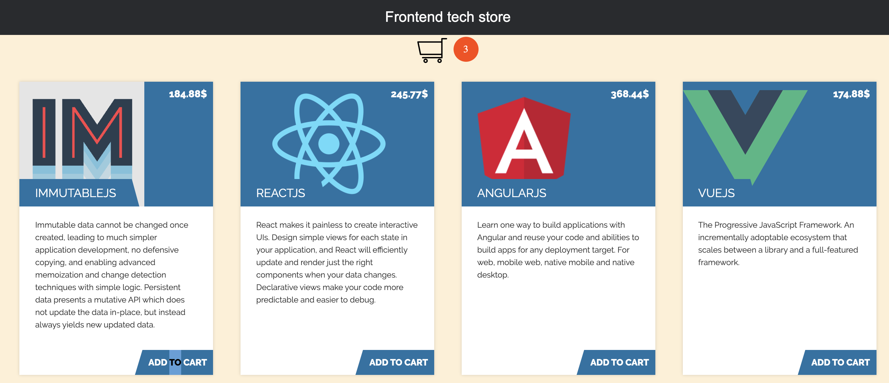

# Angular Shopping Cart

## Development
Run `npm install` for node dependencies.
Run `ng serve` for a dev server. Navigate to `http://localhost:4200/`. The app will automatically reload if you change any of the source files.

## Build

Run `ng build` to build the project. The build artifacts will be stored in the `dist/` directory. Use the `-prod` flag for a production build.

Run `npm test` to execute the unit tests via [Karma](https://karma-runner.github.io).

Run `ng generate component component-name` to generate a new component. You can also use `ng generate directive|pipe|service|class|guard|interface|enum|module`.

### `App Image`
